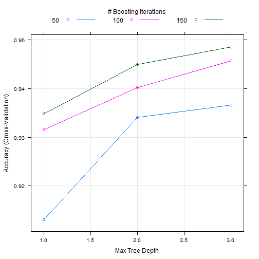

## Introduction

We build a prediction model using the spam data as provided by [Machine Learning Repository](https://archive.ics.uci.edu/ml/datasets/Spambase)
  
The prediction model is built using caret, with focus on a generalized linear model  
  
We partition the data randomly, using 75% as the training, and 25% as the test/validation set

---

## Code

The following is the code that creates the prediction mode  


```r
  require(kernlab)
  require(caret)
  require(e1071)
  data(spam)
  set.seed(12345)
  inTrain <- createDataPartition(y=spam$type,p=0.6,list=FALSE)
  training <- spam[inTrain,]
  testing <- spam[-inTrain,]
  fitControl <- trainControl(method="cv", number=10)
  modelFit <- train(type ~., data=training, method="gbm", trControl = fitControl, verbose=FALSE) 
```

---

## Measuring the accuracy

We test the model with our remaining test set
  

```r
prediction <- predict(modelFit, testing)
prediction_results <- confusionMatrix(prediction, testing$type)
prediction_results$table
```

```
##           Reference
## Prediction nonspam spam
##    nonspam    1070   60
##    spam         45  665
```

The out of sample accuracy of our model is **0.9429**

---

## Confusion Matrix


```r
plot(modelFit)
```

 

---

## Slide 5


